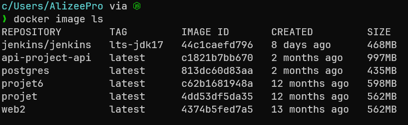
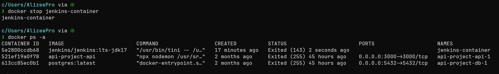
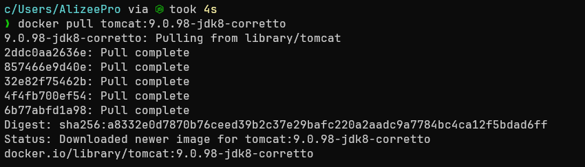
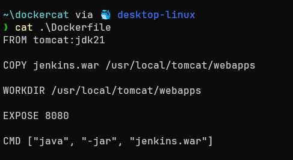
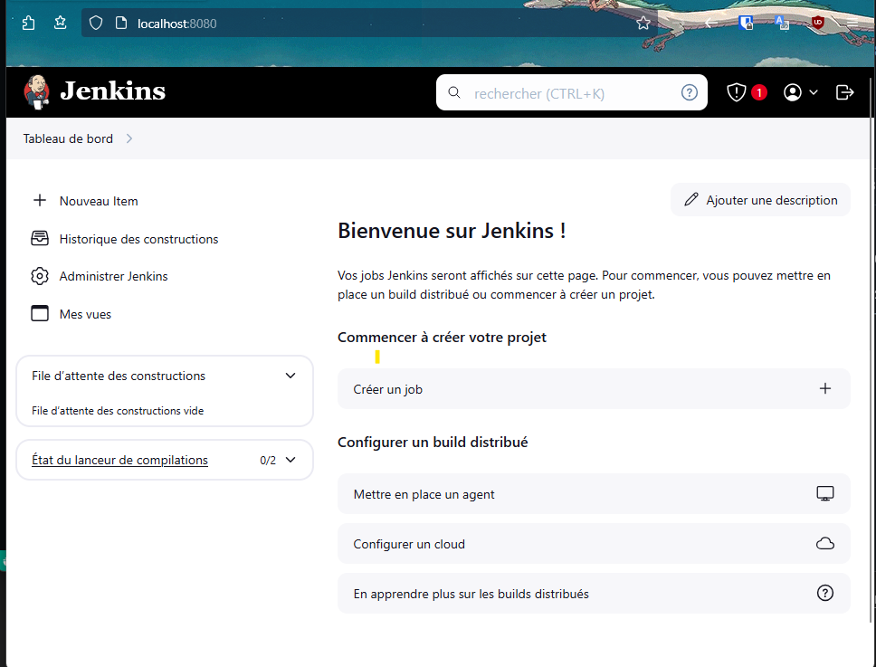

# TP 4 : DOCKER


## Proposer un service 

1. Récupération de l'image Docker 

```bash
docker pull jenkins/jenkins:lts-jdk17
```





2. Démarrage du conteneur 

```bash
docker run -it -p 8080:8080 -p 5000:5000 jenkins/jenkins:lts-jdk17
```


Après avoir mis le mdp et installer les ressources


3. La vérification de la disponibilité du service

```bash 
docker ps -a
``` 


4. L'arrêt du conteneur 

```bash 
docker stop jenkins-container
``` 




## Service from Scratch

1. Récupération des données 

```bash 
docker pull tomcat:jdk17
```



2. Création du DockerFile 



3. Création de l'image et deploiement

```bash 
docker build -t jenkins:1.0 .
```


4. Test du services

```bash 
docker run -it -p 8080:8080 jenkins:1.1
``` 

Et après téléchager les outils et mis le mdp spécifié 



