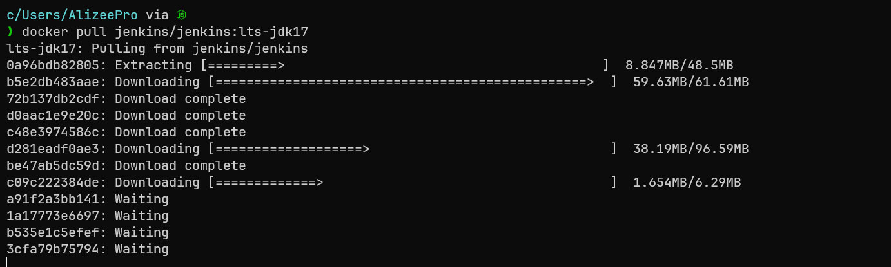
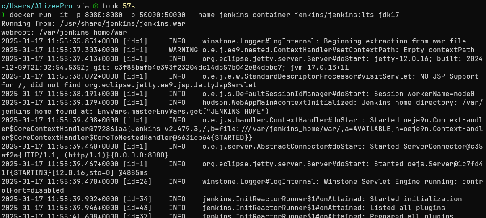
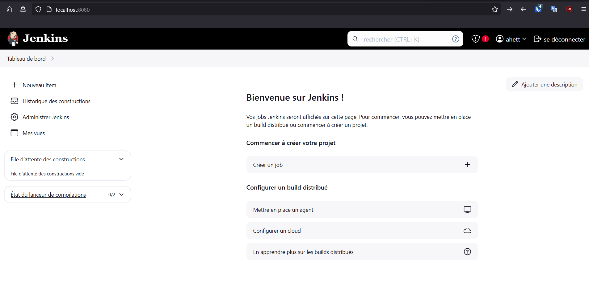
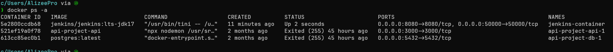

# TP 4 : DOCKER


## Proposer un service 

1. Récupération de l'image Docker 

```bash
docker pull jenkins/jenkins:lts-jdk17
```




2. Démarrage du conteneur 

```bash
docker run -it -p 8080:8080 -p 5000:5000 jenkins/jenkins:lts-jdk17
```



Après avoir mis le mdp et installer les ressources




3. La vérification de la disponibilité du service

```bash 
docker ps -a
``` 


4. L'arrêt du conteneur 

```bash 
docker stop jenkins-container
``` 


## Service from Scratch

